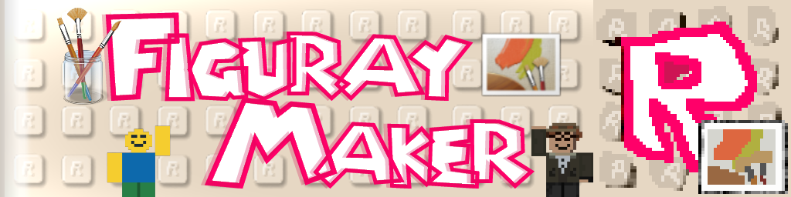

<div align="center">
  

  # FigurayMaker

  ### <p>Make your own custom character sprites and pixel avatars!</p>
  
</div>

A specialized, professional pixel art editor and sprite construction studio built specifically for designing and exporting character sprites and pixel avatars.

Features exact anatomical dimensions (Head 9×8, Torso 11×10, Arms 5×10, Legs 11×10), moveable guide overlays, advanced layer management, reference image tracing, freehand lasso and box selection tools with pixel moving, and high-resolution PNG export.

---

## Features

### Drawing guides
- **Standard Proportions**: Built-in visual wireframe matching authentic classic blocky character proportions:
  - **Head**: 9×8 pixels (rounded retro head outline)
  - **Torso**: 11×10 pixels
  - **Left & Right Arms**: 5×10 pixels each
  - **Legs**: 11×10 pixels with center seam divider (1px line)
- **Draggable Guide System**: Toggle "Move Guide" mode or hold <kbd>Alt</kbd> to drag the reference body guide anywhere on the canvas, with 1px nudge controls and auto-centering.
- **Dimension Number Overlays**: Toggle vertical and horizontal pixel coordinate numbers directly on the body zones for exact measurement matching.

### Drawing tools & Mirror mode
- **Drawing Tools**:
  - **Pencil (`P`)**: Pixel-by-pixel drawing with selectable brush size (1px to 4px).
  - **Eraser (`E`)**: Erase pixels back to transparency.
  - **Paint Bucket (`B`)**: Flood fill contiguous color areas.
  - **Eyedropper (`I`)**: Pick colors from active or composite visible layers.
  - **Line Tool (`L`)**: Bresenham line drawing algorithm.
  - **Rectangle (`U`) & Filled Rectangle**: Crisp pixel boxes and solid fills.
  - **Circle (`C`) & Filled Circle**: Midpoint circle algorithm.
  - **Lighten / Dodge**: Brighten existing pixel shades.
  - **Darken / Burn**: Deepen shadows and create shading.
  - **Color Replace**: Swap all matching color occurrences on the active layer in a single click.
- **Auto Switch to Pencil after Eyedropper**: Toggle checkbox located at the bottom of the tools sidebar in the left panel (off by default, with hover tooltip). When enabled, sampling any color with the Eyedropper (from the canvas, floating reference image window, or browser color sampler) immediately restores the Pencil drawing tool so you can pick and draw continuously.
- **Vertical Symmetry / Mirror Mode (`S`)**: Automatically mirrors strokes along the character's torso centerline for rapid front-facing sprite design.

### Selection & Transformation engine
- **Box Select (`M`)**: Rectangular marquee selection.
- **Freehand Lasso Select (`Q`)**: Draw any enclosed polygon boundary to select non-rectangular regions using a scanline point-in-polygon engine.
- **Pixel Area Movement**:
  - Click or touch inside an active selection to lift pixels into a floating buffer.
  - Drag freely across the canvas to reposition.
  - Use keyboard arrow keys (<kbd>↑</kbd>, <kbd>↓</kbd>, <kbd>←</kbd>, <kbd>→</kbd>) to nudge floating pixels by 1px increments.
  - Press <kbd>Enter</kbd> or click **Stamp** to commit moved pixels to the layer.
- **Deletion**: Press <kbd>Delete</kbd> or <kbd>Backspace</kbd>, or click **Delete Pixels** to erase selected areas cleanly.
- **Transformation**: Flip selection horizontally or vertically.
- **On-Canvas Floating Action Bar**: Dedicated quick-action pill with Stamp, Delete, Flip, and Deselect controls optimized for mouse and touchscreen gestures.

### Layer management
- Unlimited transparent layers with custom naming and reordering.
- Per-layer visibility toggle, lock protection, and opacity slider (0% to 100%).
- **Duplicate Layer** and **Merge Down** operations.
- Undo / Redo history with multi-step stack.

### Reference images & Tracing overlays
- Upload multiple reference images (character concepts, turnarounds, clothing templates).
- **Trace Mode**: Overlay translucent reference images directly onto the canvas with adjustable opacity, position offset, and scaling.
- **Floating PIP Window**: Detachable, draggable, and zoomable picture-in-picture preview window.

### Real-time preview & Canvas backgrounds
- **Synchronized Backgrounds**: Toggle between Dark Checkerboard (`Dark-Check`, default across all themes for optimal contrast with characters and noobs), Light Checkerboard (`Light-Check`), authentic Retro Grey (`#404044`), and solid Dark (`#121318`).
- **Unified Preview & Stage**: Changing the background in the Real-time Preview panel, bottom canvas indicator, or top bar immediately updates both the 1×/3× real-time preview and the main central drawing canvas stage regardless of the active UI theme.

### Canvas presets & Saving/loading
- **Built-in Presets**:
  - **Retro Dev Classic (21 × 28)**: Exact wiki body boundary.
  - **With Headroom / Hats (25 × 32)**: +4px top margin for hats and hair, +2px side margins for equipment.
  - **Square Avatar (32 × 32)**: Standard square format for game engines and profile icons.
  - **Extended Gear Space (36 × 36)**: Extra space for wings, capes, giant swords, and accessories.
- **Custom Dimensions**: Resize canvas to any width/height with anchor alignment (Center, Top-Left, Bottom-Center).
- **Starter Templates**: Blank, Classic Noob, Guest, BluuDude (Glitch Hacker), iBot (Cybernetic), and Neutral Wireframe.
- **Save & Load JSON**: Export and import complete `.json` project files preserving all layers, references, palette, and guide positions.

### Export options
- Export crisp PNG files at multiple scales (1×, 2×, 4×, 8×, 16×, 32×) or custom pixel dimensions with aspect ratio preservation.
- Background selection: Transparent, solid custom color, or checkerboard.
- Optional inclusion of reference guides and dimension markers.

### Responsive & Touch gestures
- **1-Finger Draw & Touch Select**: Smooth touch drawing and selection movement.
- **2-Finger Pinch Zoom & Pan**: Fluid navigation on mobile devices and tablets.
- **Horizontally Scrollable Header**: Full access to all top-bar controls on small screens.
- **Resizable Sidebars**: Draggable splitter handles to customize sidebar widths or collapse them.
- **Snappy Mode Toggle**: Turn off CSS transitions for ultra-low latency, instant-response drawing.

---

## Keyboard Shortcuts

| Shortcut | Action |
| :--- | :--- |
| <kbd>P</kbd> | Pencil Tool |
| <kbd>E</kbd> | Eraser Tool |
| <kbd>B</kbd> | Bucket Fill Tool |
| <kbd>I</kbd> | Eyedropper Tool |
| <kbd>L</kbd> | Line Tool |
| <kbd>U</kbd> | Rectangle Tool |
| <kbd>C</kbd> | Circle Tool |
| <kbd>M</kbd> | Box Select Tool |
| <kbd>Q</kbd> | Lasso Select Tool |
| <kbd>S</kbd> | Toggle Vertical Symmetry / Mirror Mode |
| <kbd>G</kbd> | Toggle Pixel Grid |
| <kbd>H</kbd> | Toggle Body Guides |
| <kbd>N</kbd> | Toggle Dimension Numbers |
| <kbd>[</kbd> / <kbd>]</kbd> | Decrease / Increase Brush Size |
| <kbd>Ctrl</kbd> + <kbd>Z</kbd> | Undo |
| <kbd>Ctrl</kbd> + <kbd>Y</kbd> / <kbd>Ctrl</kbd> + <kbd>Shift</kbd> + <kbd>Z</kbd> | Redo |
| <kbd>Delete</kbd> / <kbd>Backspace</kbd> | Delete Selected Pixels |
| <kbd>Enter</kbd> | Stamp / Commit Floating Selection |
| <kbd>Escape</kbd> | Deselect Active Selection |
| <kbd>Arrow Keys</kbd> | Nudge Floating Selection by 1px |
| <kbd>Space</kbd> + Drag / Middle Click | Pan Canvas Stage |
| Mouse Wheel | Zoom In / Out |

---

## Tech used

- **Framework**: React 19 + TypeScript
- **Bundler & Dev Server**: Vite 8
- **Styling**: Tailwind CSS v4
- **Icons**: Lucide React
- **Canvas Rendering**: High-performance dual-canvas architecture (HTML5 Canvas 2D Context + CSS integer pixel scaling)

---

## Getting Started

### Prerequisites
- Node.js (v18.0.0 or higher recommended)
- npm or yarn

### Installation
1. Clone the repository:
   ```bash
   git clone <repository-url>
   cd retro-dev-sprite-maker
   ```

2. Install dependencies:
   ```bash
   npm install
   ```

3. Start the development server:
   ```bash
   npm run dev
   ```
   Open your browser and navigate to `http://localhost:3000`.

### Available Scripts
- `npm run dev`: Starts the local Vite development server on port 3000.
- `npm run build`: Compiles TypeScript and creates a production bundle in `dist/`.
- `npm run preview`: Locally preview the production build.
- `npm run lint`: Runs TypeScript type checking (`tsc --noEmit`).

---

## Project Structure

```
├── FigurayMaker.png             # Application brand and avatar logo image
├── FigurayMaker.ico             # Windows/favicon ICO resource
├── public/                      # Static web assets served by Vite
│   ├── favicon.ico              # Browser tab icon (.ico format)
│   ├── favicon.png              # Browser tab icon (.png format)
│   ├── FigurayMaker.ico         # FigurayMaker icon resource
│   └── FigurayMaker.png         # FigurayMaker high-res icon
├── index.html                   # HTML entry point with metadata and favicon links
├── package.json                 # Project dependencies and npm scripts
├── tsconfig.json                # TypeScript compiler configuration
├── vite.config.ts               # Vite bundler configuration
└── src/
    ├── App.tsx                  # Main application state, shortcut manager, and layout
    ├── main.tsx                 # React application mounting entry point
    ├── index.css                # Global styles, Tailwind imports, and pixelated canvas rules
    ├── components/
    │   ├── CanvasArea.tsx       # Main drawing canvas, zoom/pan stage, and selection overlay
    │   ├── ColorPalette.tsx     # Color picker, swatch palette presets, and custom colors
    │   ├── CustomCanvasModal.tsx# Custom dimension resize modal with anchor points
    │   ├── ExportModal.tsx      # High-res PNG export modal with scaling and backgrounds
    │   ├── GuideModal.tsx       # Anatomical wiki guide documentation modal
    │   ├── Header.tsx           # Horizontally scrollable top bar with toggles and menus
    │   ├── LayersPanel.tsx      # Layer stack list, visibility, locking, and opacity
    │   ├── MiniPreview.tsx      # Real-time 1:1 sprite preview thumbnail
    │   ├── ReferenceManager.tsx # Multiple reference image manager with trace options
    │   └── Toolbar.tsx          # Resizable tool palette, brush sizes, and selection actions
    ├── constants/
    │   └── retroDev.ts          # Body dimension constants, presets, and starter templates
    ├── types/
    │   └── sprite.ts            # TypeScript interfaces for layers, selections, palettes, and projects
    └── utils/
        └── pixelMath.ts         # Bresenham lines, flood fill, polygon math, and color adjusters
```

---

## License

This project is open source and available under the [Apache License 2.0](../LICENSE).